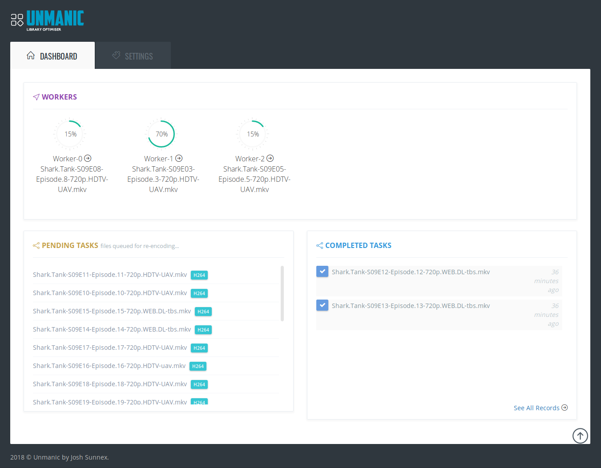
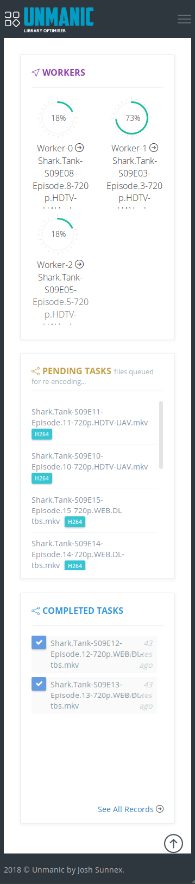

# Unmanic - Library Optimiser

Unmanic is a simple tool for optimising your video library to a single format. The ultimate goal of Unmanic is to take the complexity out of converting your whole media library. The idea is to simply point Unmanic at your library and let it manage it.

Unmanic provides you with the following main functions:

 - A scheduler built in to scan your whole library for files that do not conform to your configured video presets. Videos found with incorrect formats are then queued for conversion.

 - A folder watchdog. When a video file is modified or a new file is added in your library, Unmanic is able to check that video against your configured video presets. Like the first function, if this video is not formatted correctly it is added to a queue for conversion.

 - A handler to manage multiple file conversion tasks at a time using ffmpeg

 - A Web UI to easily configure your preferred video presets and monitor the progress of your library conversion.


### Table Of Contents

[Dependencies](#dependencies)

[Screen-shots](#screen-shots)
  * [Desktop](#desktop)
  * [Mobile](#mobile)

[Install and Run](#install-and-run)

[License and Contribution](#license-and-contribution)


## Dependencies

 - Python 3.x ([Install](https://www.python.org/downloads/))
 - FFMPEG ([Install](https://www.ffmpeg.org/))
 - To install requirements run 'python3 -m pip install -r requirements.txt' from the project root

## Screen-shots

#### Desktop:



#### Mobile:




## Install and Run

It is recommended to run this application with Docker. 

```
PUID=$(id -u)
PGID=$(id -g)

# CONFIG_DIR - Where you settings are saved
CONFIG_DIR=/config

# TZ - Your time zone
TZ=Pacific/Auckland

# LIBRARY_DIR - The location/locations of your library
LIBRARY_DIR=/library

# CACHE_DIR - A tmpfs or and folder for temporary conversion files
CACHE_DIR=/tmp/unmanic

docker run -ti --rm \
    -e PUID:${PUID} \
    -e PGID:${PGID} \
    -e TZ:${TZ} \
    -p 8888:8888 \
    -v ${CONFIG_DIR}:/config \
    -v ${LIBRARY_DIR}:/library \
    -v ${CACHE_DIR}:/tmp/unmanic \
    josh5/unmanic:latest
```

Otherwise install the dependencies listed above and then run:

```
python3 ./service.py
```

## License and Contribution

This projected is licensed under th GPL version 3. 

Copyright (C) Josh Sunnex - All Rights Reserved

Permission is hereby granted, free of charge, to any person obtaining a copy
of this software and associated documentation files (the "Software"), to deal
in the Software without restriction, including without limitation the rights
to use, copy, modify, merge, publish, distribute, sublicense, and/or sell
copies of the Software, and to permit persons to whom the Software is
furnished to do so, subject to the following conditions:
 
The above copyright notice and this permission notice shall be included in all
copies or substantial portions of the Software.

This project contains 'plugins' imported from external authors. Please refer to the source of these plugins for more information on their respective licenses.

See [CONTRIBUTING.md](docs/CONTRIBUTING.md) to learn how to contribute to Unmanic.
